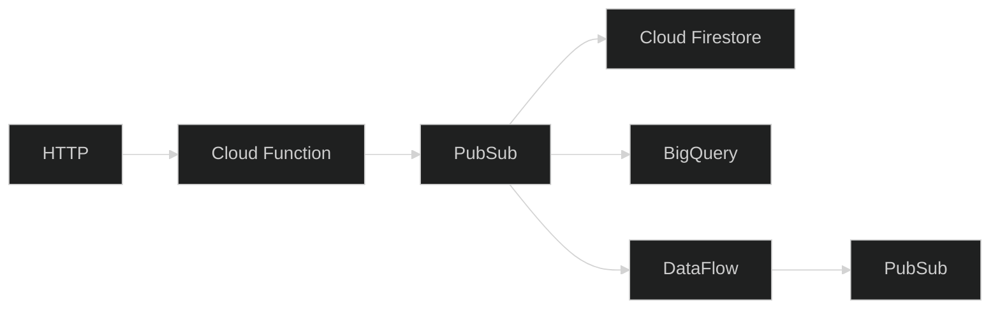
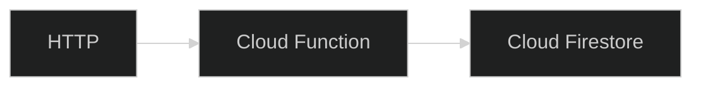

## GCP Launchpad

---

<style type="text/css">
    :root {
        --r-main-font-size: 24px;
    }
</style>

# Day 1

---

## Introductions

* Who are you?
* What's your experience with GCP and other cloud providers?
* What do we need to know about you?
* Pick the next person, and get them to introduce themselves.

---

### Launchpad goals - broad

* Get confident with common GCP use cases.
* Do it in an Infinity Works way.
  * Infrastructure as code.
  * Collaborative.
  * Build something.

---

### Goals

* Use Infrastructure as Code.
* Use the console and CLI.
* Build a REST API
* Publish and subscribe to messages.
* Analyse data at rest.
* Analyse streaming data.
* Troubleshoot issues.

---

### Task: Group exercise - 10 mins

* What questions do we have so far?

---

## Cloud intro

---

### Task: Group exercise - 10 mins

* What are the core components of a cloud platform?
* What's the minimal viable cloud?

---

### Task: Fill in the blanks!

<div style="font-size: x-large; width: 100%">

|              | AWS               | Azure            | GCP             |
|--------------|-------------------|------------------|-----------------|
| HTTP         | API Gateway       | API Management   | ?               |
| Function     | Lambda            | Azure Functions  | ?               |
| Table        | DynamoDB          | Table Storage    | ?               |
| Blob         | S3                | Blob Storage     | ?               |
| Queue        | SQS / SNS         | Event Grid / SB  | ?               |
| Stream       | Kinesis Analytics | Stream Analytics | ?               |
| Workflow     | Step Functions    | Logic Apps       | ?               |
| Lake         | S3 / Athena       | Data Lake        | ?               |

</div>


---

### Answer

<div style="font-size: x-large">

|              | AWS               | Azure            | GCP             |
|--------------|-------------------|------------------|-----------------|
| HTTP         | API Gateway       | API Management   | API Gateway     |
| Function     | Lambda            | Azure Functions  | Function        |
| Table        | DynamoDB          | Table Storage    | Firestore       |
| Blob         | S3                | Blob Storage     | Cloud Storage   |
| Queue        | SQS / SNS         | Event Grid / SB  | Cloud Pub / Sub |
| Stream       | Kinesis Analytics | Stream Analytics | Cloud Dataflow  |
| Workflow     | Step Functions    | Logic Apps       |                 |
| Lake         | S3 / Athena       | Data Lake        | Big Query       |

</div>

---

### Challenge

> As an utilities company, we want to collect regular meter readings from our customer's smart meters and industrial equipment.
>
> The goal is to be able to measure energy consumption over a period.

---

### Challenge - technical details

> The smart meter provider we use can POST readings as JSON over HTTPS.

```
POST /samples
```

```json
{
  "name": "meter-xyz",
  "value": 123.45
}
```

---

### Target architecture

<style type="text/css">
pre {
  line-height: 1 !important;
}
</style>



---

### Initial architecture

<style type="text/css">
pre {
  line-height: 1 !important;
}
</style>



---

### Setup

* Setup GCP account
  * Sign up using the free tier
  * https://cloud.google.com/free
* Setup Google CLI
  * https://cloud.google.com/sdk/gcloud
* Install Terraform
  * https://developer.hashicorp.com/terraform/downloads
* Install Terraform developer tooling
  * VS Code Extension  / Neovim LSP configuration etc.
* Create "Project" in GCP to use
  * https://cloud.google.com/resource-manager/docs/creating-managing-projects

---

# Day 2

---

### Cloud Functions Intro

https://cloud.google.com/functions

> Run your code in the cloud with no servers or containers to manage with our scalable, pay-as-you-go functions as a service (FaaS) product.

---

### Cloud Functions Free Tier

> New customers get $300 in free credits to spend on Functions.

> All customers get 2 million monthly invocations free, not charged against your credits.

---

### Videos

* Cloud Functions gen2
  * https://www.youtube.com/watch?v=ATBDTTM-Ohk

---

### Chalkboard: How Cloud Functions 2 is built on top of GCP

* Cloud Build
* Cloud Run
* IAM

---

### Group discussion: Functions vs containers vs instances?

* Pros / cons of function runtimes.
* Differences with other function platforms?

---

## Terraform

---

### Terraform features

* Define cloud resources as code
* Run `terraform apply` to update
* Supports multiple clouds via providers
* Extensible via modules
* Uses HCL language instead of YAML, JSON

---

### HCL

```terraform
resource "random_id" "bucket" {
  byte_length = 8
}

resource "google_storage_bucket" "bucket" {
  name                        = "name-${random_id.bucket.hex}"
  location                    = var.region
  uniform_bucket_level_access = true
  public_access_prevention    = "enforced"
}
```

* Resource types
* Resource IDs
* Arguments
* Variables
* Cross references

https://tinyurl.com/3tnhm5w7

---

### Task: Group discussion - Terraform experience

* Pros / cons
* Similarities to CDK / CloudFormation?

---

### Terraform - Logging in to GCP

https://registry.terraform.io/providers/hashicorp/google

```
gcloud auth application-default login
```

#### Main.tf

```terraform
provider "google" {
  project = "{{YOUR GCP PROJECT}}" # Use variables instead?
  region  = "us-central1"
  zone    = "us-central1-c"
}
```

---

### Workshop: Build GET and POST HTTP Cloud Functions

* Duration - 2 sessions

---

### Task: Put these resources in the order you need them...

* Output the Function URI
* Enable public access to the function's HTTP endpoint
  * google_cloud_run_service_iam_member
  * Grant `roles/run.invoker` role to `allUsers`
* Create a REST API in Go, Node, Python, .NET, or Java
* Initialize the Google Terraform provider in `main.tf`
  * `required_providers`
* Create a Cloud Function 
  * google_cloudfunctions2_function
* Upload your code zip to the bucket
  * google_storage_bucket_object
* Use the Google Functions Framework in your code to initialize a function endpoint
  * https://github.com/GoogleCloudPlatform/functions-framework-go
* Create a bucket to store function code
  * google_storage_bucket
* Create a zip file of your function code

---

# Day 3

---

# Cloud Firestore Intro

---

# Upsert and Query Firestore From Cloud Functions

* Duration - 2 sessions

---

# Single table design introduction

---

# Day 4

---

# PubSub Intro

---

# Send to PubSub from Cloud Functions

---

# Subscribe Cloud Functions to PubSub

---

# Subscribe to PubSub from Cloud Firestore

---

# Social!

---

# Day 5

---

# Project tidy up time!

* Duration - 2 sessions

---

# Demo time

---

# Project overview

* Example project overview from someone that's implemented a project on GCP

---

# Day 6

---

# Intro to BigQuery

---

# Import data to BigQuery from PubSub

---

# Query JSON data in BigQuery - GroupBy, Sum

---

# Day 7

---

# Intro to Github Actions

* What is CI/CD?
* Why do we use it?
* Authentication
  * OIDC vs access tokens
* Workflows
* Configuration

---

# Workshop: Setup CI/CD Pipeline

* Duration - 2 sessions

---

# Q&A panel existing experts

---

# Day 8

---

# Intro to GCP DataFlow

* Streaming data
* Event sourcing
* Stateless functions
* Stateful functions

---

# Workshop: Dataflow Hello World

* WordCount - Hello World
* Setup Python environment

---

# Workshop: Dataflow streaming

* Maintain average over last 24 samples

---

# Day 9

---

# Social

---

# Project time

* Duration - 2 sessions

---

# Feedback / 1-1s

---

# Day 10

---

# Project time

* Duration - 2 sessions

---

# Final demos

---

# Final retro

---
