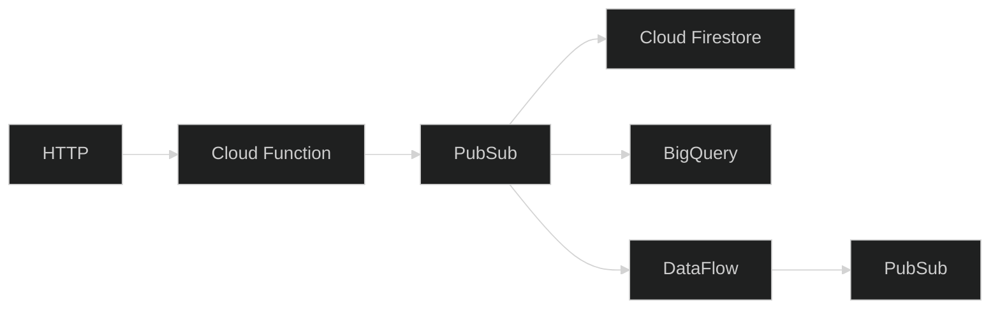
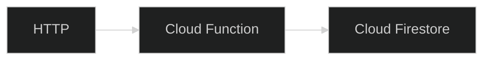

## GCP Launchpad

---

<style type="text/css">
    :root {
        --r-main-font-size: 24px;
    }
</style>

# Day 1

---

## Introductions

* Who are you?
* What's your experience with GCP and other cloud providers?
* What do we need to know about you?
* Pick the next person, and get them to introduce themselves.

---

### Launchpad goals - broad

* Get confident with common GCP use cases.
* Do it in an Infinity Works way.
  * Infrastructure as code.
  * Collaborative.
  * Build something.

---

### Goals

* Use Infrastructure as Code.
* Use the console and CLI.
* Build a REST API
* Publish and subscribe to messages.
* Analyse data at rest.
* Analyse streaming data.
* Troubleshoot issues.

---

### Task: Group exercise - 10 mins

* What questions do we have so far?

---

## Cloud intro

---

### Task: Group exercise - 10 mins

* What are the core components of a cloud platform?
* What's the minimal viable cloud?

---

### Task: Fill in the blanks!

<div style="font-size: x-large; width: 100%">

|              | AWS               | Azure            | GCP             |
|--------------|-------------------|------------------|-----------------|
| HTTP         | API Gateway       | API Management   | ?               |
| Function     | Lambda            | Azure Functions  | ?               |
| Table        | DynamoDB          | Table Storage    | ?               |
| Blob         | S3                | Blob Storage     | ?               |
| Queue        | SQS / SNS         | Event Grid / SB  | ?               |
| Stream       | Kinesis Analytics | Stream Analytics | ?               |
| Workflow     | Step Functions    | Logic Apps       | ?               |
| Lake         | S3 / Athena       | Data Lake        | ?               |

</div>


---

### Answer

<div style="font-size: x-large">

|              | AWS               | Azure            | GCP             |
|--------------|-------------------|------------------|-----------------|
| HTTP         | API Gateway       | API Management   | API Gateway     |
| Function     | Lambda            | Azure Functions  | Function        |
| Table        | DynamoDB          | Table Storage    | Firestore       |
| Blob         | S3                | Blob Storage     | Cloud Storage   |
| Queue        | SQS / SNS         | Event Grid / SB  | Cloud Pub / Sub |
| Stream       | Kinesis Analytics | Stream Analytics | Cloud Dataflow  |
| Workflow     | Step Functions    | Logic Apps       |                 |
| Lake         | S3 / Athena       | Data Lake        | Big Query       |

</div>

---

### Emoji check:

How well do you think you understand the core services components of cloud platforms?

1. 😢 Haven't a clue, please help!<br/>
2. 🙁 I'm starting to get it but need to go over some of it please<br/>
3. 😐 Ok. With a bit of help and practice, yes<br/>
4. 🙂 Yes, with team collaboration could try it<br/>
5. 😀 Yes, enough to start working on it collaboratively<br/>

<aside class="notes">
    The phrasing is such that all answers invite collaborative effort, none require solo knowledge.

    The 1-5 are looking at (a) understanding of content and (b) readiness to practice the thing being covered, so:

    1. 😢 Haven't a clue what's being discussed, so I certainly can't start practising it (play MC Hammer song)
    2. 🙁 I'm starting to get it but need more clarity before I'm ready to begin practising it with others
    3. 😐 I understand enough to begin practising it with others in a really basic way
    4. 🙂 I understand a majority of what's being discussed, and I feel ready to practice this with others and begin to deepen the practice
    5. 😀 I understand all (or at the majority) of what's being discussed, and I feel ready to practice this in depth with others and explore more advanced areas of the content
</aside>

---

### Challenge

> As an utilities company, we want to collect regular meter readings from our customer's smart meters and industrial equipment.
>
> The goal is to be able to measure energy consumption over a period.

---

### Challenge - technical details

> The smart meter provider we use can POST readings as JSON over HTTPS.

```
POST /samples
```

```json
{
  "name": "meter-xyz",
  "value": 123.45
}
```

---

### Target architecture

<style type="text/css">
pre {
  line-height: 1 !important;
}
</style>



---

### Initial architecture

<style type="text/css">
pre {
  line-height: 1 !important;
}
</style>



---

### Setup

* Setup GCP account
  * Sign up using the free tier
  * https://cloud.google.com/free
* Setup Google CLI
  * https://cloud.google.com/sdk/gcloud
* Install Terraform
  * https://developer.hashicorp.com/terraform/downloads
* Install Terraform developer tooling
  * VS Code Extension  / Neovim LSP configuration etc.
* Create "Project" in GCP to use
  * https://cloud.google.com/resource-manager/docs/creating-managing-projects

---

# Day 2

---

### Cloud Functions Intro

https://cloud.google.com/functions

> Run your code in the cloud with no servers or containers to manage with our scalable, pay-as-you-go functions as a service (FaaS) product.

---

### Cloud Functions Free Tier

> New customers get $300 in free credits to spend on Functions.

> All customers get 2 million monthly invocations free, not charged against your credits.

---

### Videos

* Cloud Functions gen2
  * https://www.youtube.com/watch?v=ATBDTTM-Ohk

---

### Chalkboard: How Cloud Functions 2 is built on top of GCP

* Cloud Build
* Cloud Run
* IAM

---

### Group discussion: Functions vs containers vs instances?

* Pros / cons of function runtimes.
* Differences with other function platforms?

---

## Terraform

---

### Terraform features

* Define cloud resources as code
* Run `terraform apply` to update
* Supports multiple clouds via providers
* Extensible via modules
* Uses HCL language instead of YAML, JSON

---

### HCL

```terraform
resource "random_id" "bucket" {
  byte_length = 8
}

resource "google_storage_bucket" "bucket" {
  name                        = "name-${random_id.bucket.hex}"
  location                    = var.region
  uniform_bucket_level_access = true
  public_access_prevention    = "enforced"
}
```

* Resource types
* Resource IDs
* Arguments
* Variables
* Cross references

https://tinyurl.com/3tnhm5w7

---

### Task: Group discussion - Terraform experience

* Pros / cons
* Similarities to CDK / CloudFormation?

---

### Terraform - Logging in to GCP

https://registry.terraform.io/providers/hashicorp/google

```
gcloud auth application-default login
```

#### Main.tf

```terraform
provider "google" {
  project = "{{YOUR GCP PROJECT}}" # Use variables instead?
  region  = "us-central1"
  zone    = "us-central1-c"
}
```

---

### Workshop: Build GET and POST HTTP Cloud Functions

* Duration - 2 sessions

---

### Task: Put these resources in the order you need them...

* Output the Function URI
* Enable public access to the function's HTTP endpoint
  * google_cloud_run_service_iam_member
  * Grant `roles/run.invoker` role to `allUsers`
* Create a REST API in Go, Node, Python, .NET, or Java
* Initialize the Google Terraform provider in `main.tf`
  * `required_providers`
* Create a Cloud Function 
  * google_cloudfunctions2_function
* Upload your code zip to the bucket
  * google_storage_bucket_object
* Use the Google Functions Framework in your code to initialize a function endpoint
  * https://github.com/GoogleCloudPlatform/functions-framework-go
* Create a bucket to store function code
  * google_storage_bucket
* Create a zip file of your function code

---

# Day 3

---

### Cloud Firestore: Discussion

* Database types
  * Key/value
  * Document
  * Graph
  * Relational
* Reliability
  * Mirroring
  * Clustering
  * CAP theorem
* Security
  * Encryption in transit
  * Encryption at rest

---

### Cloud Firestore: API

```go
func main() {
  conf := &firebase.Config{ProjectID: "My GCP project"}

  app, err := firebase.NewApp(ctx, conf)
  if err != nil { return }

  client, err := app.Firestore(ctx)
  if err != nil { return }

  collection := client.Collection("samples")

  // Upsert.
  _, err = collection.Doc(id).Set(ctx, Sample{Name:"test",Value:123.45})
  if err != nil { return }

  // Get
  doc, err := collection.Doc(id).Get(ctx)
  if err != nil || !doc.Exists() { return }
}
```

---

### Cloud Firestore: Console

* Insert, and delete data
* Execute queries

---

### Upsert and Query Firestore From Cloud Functions

* Duration - 3 sessions
* Update your REST API to store the sample data it receives
* Add an endpoint to query the data back, by name
* Bonus - use the Cloud Firestore emulator


---

### Put these in the right order

* Update your code to take environment variables to use for the Google Project ID.
* Initialize a Firebase SDK app using the Project ID.
* Use the Firebase SDK to create a Firestore Client.
* Get the collection from the Firebase Client.
* Create a `google_app_engine_application` in Terraform to initialize Firestore in the project.
* Use the Firebase collection to `Set` and `Get` documents from the datbase. 
* Update your Cloud Function Terraform file to pass environment variables to the Cloud Function containing the Project ID.

---

# Day 4

---

### Group Discussion: Messaging

* Why would you want a message queue in an application?
* Where have you used one and it worked well?
* Where did it make things more complex?

---

### Group Discussion: Messaging topologies

Where is each one useful?

| Producers | Consumers | Receivers |
|-----------|-----------|-----------|
| One       | One       | One       |
| One       | Many      | One       |
| One       | Many      | All       |
| Many      | One       | One       |
| Many      | Many      | One       |
| Many      | Many      | All       |

---

### Workshop: Send to PubSub from Cloud Functions

Put these in the right order:

* Add an environment variable in your Cloud Function containing the `TOPIC_ID`. 
* Create an instance of the GCP PubSub client in your code.
* Create a `google_pubsub_topic` in Terraform.
* Send data to PubSub using the GCP PubSub client.
* Add the GCP SDK for PubSub to your code.

---

### Subscribe Cloud Functions to PubSub

Don't make an infinite loop!

```hcl
event_trigger {
  trigger_region = var.zone
  event_type     = "google.cloud.pubsub.topic.v1.messagePublished"
  pubsub_topic   = google_pubsub_topic.samples.id
  retry_policy   = "RETRY_POLICY_DO_NOT_RETRY" # "RETRY_POLICY_RETRY"
}
```

Research the right format for the message handler for your chosen language.

```go
functions.CloudEvent("on-sample-published", 
  func(ctx context.Context, event cloudevents.Event) error {
    var sample models.Sample
    err := event.DataAs(&sample)
    if err != nil {
      h.Log.Error("failed to unmarshal sample", zap.Error(err))
      return err
    }
    h.Log.Info("processed event", zap.Any("sample", sample))
})
```

---

### Discussion: Subscribe Cloud Firestore changes

* Why might this be useful?
* Where have we done something like this in projects?

---

### Social

---

# Day 5

---

### Project tidy up

* Duration - 2 sessions
* Get your project ready for a demo
  * What was just how you expected?
  * What didn't you expect?
  * How have you structured your project?
  * What structure have you seen so far that you liked the most?

---

### Demo time!

---

### Project overview

* Example project overview from someone that's implemented a project on GCP

---

# Day 6

---

### Intro to BigQuery

* Fixed cluster size databases, SQL Server etc.
* Data warehouse alternatives, Snowflake, Athena
* Payment model
* Type system
  * Typical SQL definitions
  * JSON type

---

### Import data to BigQuery from PubSub

* Create subscription to PubSub and put the data into BigQuery.
* Use the `google_pubsub_scription` Terraform resource.
* Send data to BiqQuery by posting a sample to your REST API.

---

### Query JSON data in BigQuery - GroupBy, Sum

* Query the data from within BigQuery.
* Sum all the samples you've got.
* Sum all the samples with a value for each of the last 7 days.
* Find the day with the biggest increase between the lower and upper bounds for a single name.

---

### Day 7

---

### Intro to Github Actions

* What is CI/CD?
* Why do we use it?
* Authentication
  * OIDC vs access tokens
* Workflows
* Configuration

---

### Workshop: Setup CI/CD Pipeline

* Duration - 2 sessions
* Automate the creation of your infrastructure from the git repo.

---

### Q&A panel existing experts

---

# Day 8

---

### Group Discussion: Streaming data

* Streaming data
* Event sourcing
* Stateless functions
* Stateful functions

---

### Stateful functions

* Apache Beam framework
   * Supported runtimes.
   * Java best support, with Python 2nd.

---

### Beam job anatomy

```python
def main(argv=None, save_main_session=True):
  parser = argparse.ArgumentParser()
  parser.add_argument(
      '--input',
      dest='input',
      default='gs://dataflow-samples/shakespeare/kinglear.txt',
      help='Input file to process.')
  parser.add_argument(
      '--output',
      dest='output',
      default='op.txt',
      help='Output file to write results to.')

  known_args, pipeline_args = parser.parse_known_args(argv)

  pipeline_options = PipelineOptions(pipeline_args)
  pipeline_options.view_as(SetupOptions).save_main_session = save_main_session
  with beam.Pipeline(options=pipeline_options) as p:
    lines = p | ReadFromText(known_args.input)

    counts = (
        lines
        | 'Split' >> (
            beam.FlatMap(
                lambda x: re.findall(r'[A-Za-z\']+', x)).with_output_types(str))
        | 'PairWithOne' >> beam.Map(lambda x: (x, 1))
        | 'GroupAndSum' >> beam.CombinePerKey(sum))

    # Format the counts into a PCollection of strings.
    def format_result(word_count):
      (word, count) = word_count
      return '%s: %s' % (word, count)

    output = counts | 'Format' >> beam.Map(format_result)

    output | WriteToText(known_args.output)


if __name__ == '__main__':
  logging.getLogger().setLevel(logging.INFO)
  main()
```

---

### Workshop: Dataflow Hello World

* Setup Python environment
  * You will need Python 3.9
  * If you use [Nix](https://github.com/a-h/gcp-data-skeleton/blob/main/dataflow/beam.nix)
* WordCount - Hello World
  * [Beam Quickstart](https://console.cloud.google.com/?walkthrough_id=dataflow--quickstart-beam--quickstart-beam-python&_ga=2.180497767.1987587226.1677161360-1453615420.1674057740&_gac=1.26380879.1675158091.CjwKCAiAleOeBhBdEiwAfgmXf8uznvxChlSc9pvTO53PG1NJMKpk9tireefPlTQ4qxj7wvBI3AaXiRoCLBQQAvD_BwE)

---

### Workshop: Dataflow streaming

* Maintain average over last 24 samples

---

# Day 9

---

### Social

---

### Project time

* Duration - 2 sessions

---

### Feedback / 1-1s

---

### Day 10

---

### Project time

* Duration - 2 sessions

---

### Final demos

---

### Final retro

---
